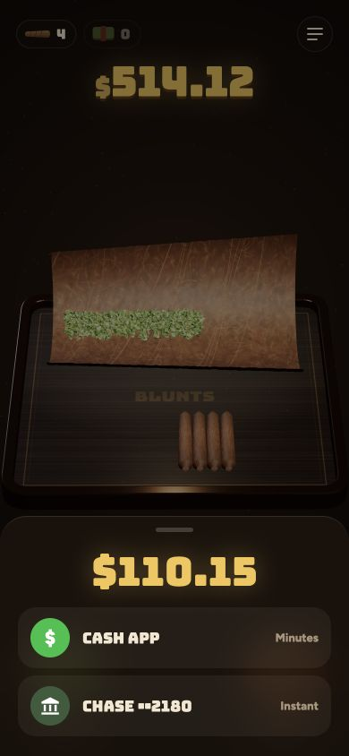
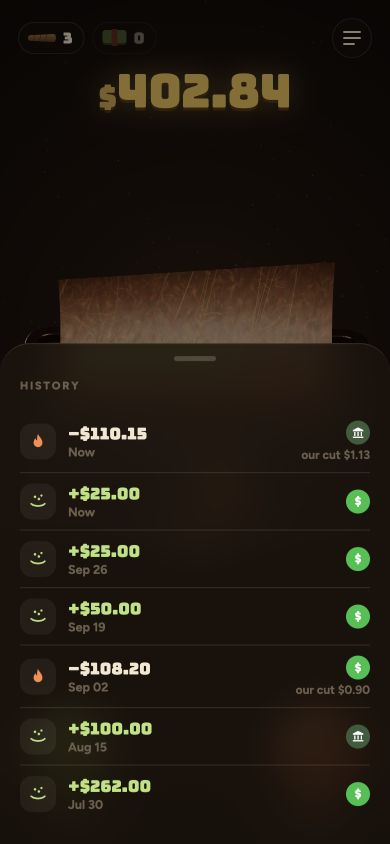

# UI, UX, and technical review

Reviewed source baseline: `9e91c76d1d4f8905d83459e0afed551dce6e83c3`. October 2, 2026. Read alongside the [120-item audit](../../docs/launch-readiness-audit.md) and [implementation plan](implementation-plan.md). This is a prototype review and production design, not proof of provider or device acceptance.

**Product decision update:** implement the [fee-based wallet specification](wallet-strategy.md). Replace the 10%-of-gains demo with approved uncapped 1% conversion previews in production; no subscription surfaces. This document records existing code behavior, not a claim that the prototype has already changed.

## Observed browser evidence

Local HTTP server served **only `prototype/`**. In-app Chromium rendered the current scene at desktop size and at 390×844 and 320×568 CSS pixels. Tested one $25 simulated fill, one-blunt simulated withdrawal, mock bank selection, history, tutorial opening and Escape dismissal. No warning/error console entries were captured in that bounded session. The earlier browser timeout in the audit is superseded for this limited path. Safari, real phones, screen readers, keyboard-only completion, all demo configurations and live provider flows remain untested.

- Fill raised the sample balance from $489.12 to $514.12. “Open Cash App” completed via a timer without opening a real payment session.
- Spark preview showed $110.15. Selecting Chase in the bank picker immediately generated a linked-looking account with random last-four digits, under a “Secured by Plaid” claim. No Plaid flow occurred.
- Payout choices said Cash App “Minutes” and Chase “Instant.” Selecting the mock bank completed the animation and reduced the sample balance to $402.84; no sale/settlement/payout evidence existed.
- History then disclosed “our cut $1.13.” That fee was not itemized in the preceding payout view.
- The blunt-mode segment appeared as an unnamed button in the accessibility tree. Dialog background controls remained in the tree. Escape closed the history sheet; do not report Escape as broken.
- At 320×568, the first tutorial page fit and its Next button remained visible. This does not establish text-scaling, keyboard, landscape, safe-area or all-card correctness.

## Findings and remedies

Severity: P0 blocks real money; P1 blocks public funded release; P2 is important product quality. A prototype can intentionally simulate actions, but it must not be presented as a connected financial service.

| Finding | Evidence | Required remedy / acceptance |
|---|---|---|
| P0: Client state is financial truth | `prototype/index.html:281`, `:861`, `:914`; fills and sales mutate `S` | Server-authorized accounts/ledger, provider-confirmed execution, durable lifecycle and reconciliation; refreshing never invents or loses money |
| P0: Fake funds and bank connections | `:1141–1175`; observed timer and fabricated Chase account | Isolate simulator, remove usable hardcoded destination from public demo, label every simulation; production uses actual provider/account bindings |
| P0: Fee model conflicts across code/research | `sparkPlan` at `:901`, tutorial at `:1305`; 10% gains versus proposed 1% flows | One legally approved fee contract and versioned calculator; preview gross sale, every fee and net before consent; receipts reconcile |
| P0: Immediate payout claim | `openCashOut` at `:1240`; observed “Instant” | Model sale, settlement and transfer separately; show conditional provider ETA/status, failure/return and support reference |
| P1: Home hides what the money represents | Primary view is amount, tray, Fill/Spark | Show instrument/ownership, total value, available cash, pending amount, valuation time and gain/loss; plain-language secondary labels “Add money”/“Sell and withdraw” |
| P1: Metaphor can imply cash preservation | $100 invested is one blunt while valuation changes | Define visual units as a representation only; show current value and losses explicitly; do not let rounded units determine balances |
| P1: Selling is celebrated as a burn/reward | Withdrawal animation, earnings claims | Test comprehension and impulsive-use risk; separate playful illustration from confirmation; no rewards for extra turnover or urgent trading nudges |
| P1: Financial disclosures buried | Tutorial rather than pretransaction/account surfaces | Visible pretrade instrument, fees, loss risk, ownership and settlement explanation; approved disclosures retrievable after consent |
| P1: Historical return copy insufficiently governed | `QQQ_YEARS`, +22% tutorial, no automated source validation | Approved dated source, NAV/market return method, dividends/fees and period; remove unlabeled arithmetic-average ambiguity; content expiry/review owner |
| P1: Missing account and service surfaces | Menu has History/How it works only | Enrollment, status recovery, profile/security, documents, support, complaints, closure/deletion and export |
| P1: Modal accessibility incomplete | `openSheet` at `:1076`, unnamed segment observed | Named dialog, accessible title, `aria-modal`, focus trap/restore, inert background, visible close/back, live status announcements; actual AT testing |
| P1: Insufficient text alternative to scene | Canvas description is “Your blunt tray” | Readable holdings/balance list independently operable without WebGL; reduced-motion path retains complete function |
| P1: Copy can falsely imply endorsement | Mock Plaid branding and Cash App handoff | Partner-approved marks and accurate linked/unlinked status; no partnership claim without permission |
| P1: Errors and interruptions have no durable semantics | In-memory timers/history and immediate mutations | Server-resumable pending/unknown/failed states; cancellation never cancels an already executed transfer by hiding a sheet |
| P1: Clipboard reports success without observing outcome | `:1155` catches and discards errors | Show success only on fulfilled write; selectable full address and alternative instructions on denial |
| P1: Client validation is insufficient | Amount input and `sparkPlan` clamp values | Server max/min/precision/limits/eligibility checks; explicitly tell users changed amounts; re-preview after change |
| P2: Visual density/readability varies | Heavy display font, dark/brown controls, large scene | Keep aesthetic for headings/scene; use readable numeric/body fonts, measured contrast, ≥44px design targets and text scale; verify rather than assume failure |
| P2: Desktop layout is essentially a phone canvas | Desktop render | Intentional responsive account shell; avoid empty space hiding information; preserve narrow-screen control reachability |
| P2: Continuous rendering and asset footprint | rAF at `:1029`; large embedded image, CDN dependency `:257` | Visibility-aware/on-demand rendering, bounded particles, disposed resources, self-hosted pinned dependencies, lazy scene and compressed licensed assets |
| P1: Missing safe fallback and performance proof | No completed GPU/context-loss/device matrix | Static accessible alternative, recoverable load failure, reduced motion, midrange-device frame/startup/memory/battery tests |
| P1: Promotional assets are drafts | `brief/`, `ad/`, research claims | Rights/claims register, clear simulation treatment, partner review; old commercial/legal promises not release copy |

Invesco currently reports 22.06% ten-year NAV performance as of June 30, 2026 on its [QQQ page](https://www.invesco.com/qqq-etf/en/home.html). That supports a dated historical figure, not the prediction “22% a year” or the full hardcoded yearly series. Verify every series point and approved presentation before publication. Current fund expenses, holdings and risk disclosures also need a content update process.

## Technical inventory: what green CI does and does not mean

Existing CI checks Python compilation, model determinism, inline JavaScript parsing and a small set of regression tests. It establishes useful prototype/tooling correctness. There is no production application build, database, backend authentication, provider-contract suite, deployment environment, native binary or real-money acceptance evidence. The research model is not a ledger. The creative-generation scripts are offline helpers; they should never run in a customer request path or be deployed with provider credentials.

| Area | Current gap | Production design |
|---|---|---|
| Application structure | Single HTML mixes simulation, UI, scene and business logic | Typed app/domain/UI/provider packages; isolate legacy prototype and deterministic fake adapter |
| Financial precision | JavaScript floats, pro-rata demo basis and client rounding | Integer USD cents or explicit fixed-decimal currency types; token/share decimal types; broker-authoritative lots and documents |
| Durability | `S`, arrays, timers disappear/reinitialize | Postgres durable intents, state transitions, events, provider IDs; worker/outbox recovery |
| Concurrency | `busy` protects one browser animation only | Transactional reservation, idempotency keys, uniqueness constraints, per-account sequencing and provider lookup on ambiguity |
| Security | No auth/tenant boundary/provider credentials architecture | Verified sessions, authorization on each object, CSRF/origin controls, restricted secrets and signed webhooks |
| Data ingestion | No webhooks/polling/market data | Durable verified events, duplicate/out-of-order handling, polling repair, time-stamped licensed marks |
| Operations | No admin/reconciliation/incident tools | Read-restricted case management, audited actions, two-person exceptional approvals, alerts and runbooks |
| Delivery | No release artifacts/hosting/migrations | Reproducible lockfile builds, reviewed IaC, staging/prod isolation, exact-artifact promotion and backward-compatible migrations |
| Native | No app project or SDK spike | Shared domain/UI with native auth/KYC/links/storage; signed device proof before framework commitment |

`innerHTML` is widespread in the prototype. Much current content is static or locally generated, so this review does not claim a demonstrated remote XSS exploit. Once bank names, support text or provider data become external, interpolation without escaping becomes an unsafe boundary. Render through escaped typed components and validate incoming schemas. Likewise, a CDN import is a supply-chain/availability dependency, not proof it is currently compromised.

## Product flow specification

**Welcome:** demo/live distinction → explanation of instrument and loss risk → eligibility → verified contact/authentication → provider KYC/status → agreements → funding setup. Allow save/resume; no silent approval or misleading “ready” before the broker account is open.

**Home:** total portfolio value with timestamp; invested positions; pending funds; cash available to invest/withdraw; gain/loss separated from contributions; plainly labeled actions and account/support access. The tray illustrates a documented amount and is never the only source of information.

**Fill:** amount → selected rail/network with costs/limits → authorization/instructions → actual pending deposit → available cash → expiring buy preview → explicit confirm → processing/partial/filled receipt. If the approved program requires combined funding/trade instructions, the user must still understand each lifecycle and cancellation boundary.

**Spark:** amount type (gross sale versus desired cash received) → available quantity/cash → sale and fee preview → confirmation → execution/settlement → verified destination → payout preview/authorization → provider status. Preserve an existing sale if payout fails; offer an approved recovery route rather than silently selling again.

**Account:** identity/status, security/recovery/devices, destinations, agreements, statements/tax records, history receipts, support/complaints, closure/deletion and required retention. Push/email are notifications of server status, never financial truth.

## Measurable release acceptance

Proposed budgets: core screen usable without 3D; web p75 LCP ≤2.5s and INP ≤200ms on the agreed test profile; responsive input and ≥30fps optional scene on the lowest supported device; no unbounded memory increase across 50 fill/spark simulations; no continuous animation while hidden; no lost state after process death. These are engineering targets, not measurements of the prototype.

Test 320/390/430px portrait, landscape and desktop; 200% text; keyboard-only; VoiceOver/TalkBack; reduced motion; color distinction without color alone; slow/offline network; denied camera/clipboard/notifications; background/foreground; device storage loss; WebGL unavailable/context loss. Check all financial amounts against provider/ledger records after each transition. Zero known critical/high security or money-integrity defects is required for funded release; “zero console errors” alone is not sufficient.
